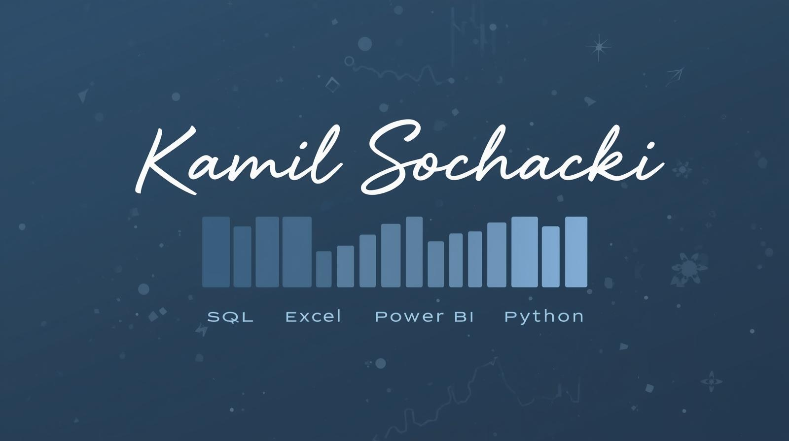

  

 

📊 I help businesses see what their data is actually saying  
🧠 Building structured SQL models and KPI frameworks  
📈 Turning dashboards into decision tools  
🎯 Preparing for PL-300 certification  
🤝 Open to collaborating on analytics & reporting projects  
🌍 Vienna-based, internationally minded  

---

## My Stack

SQL · Excel · Power BI · Python · Looker Studio  
BigQuery · dbt · Git · GitHub · Jupyter  

---

## Focus

- Business Intelligence & Reporting  
- KPI Design & Performance Analytics  
- Data Modeling & SQL Optimization  
- Dashboard Development  
- Reporting Automation  

---

## Connect

Vienna, Austria  
[LinkedIn](https://www.linkedin.com/in/yourprofile)
