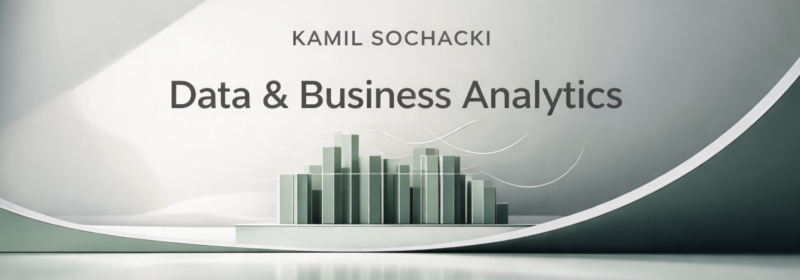

  

 

I work with data the way architects work with structure - clarity first, decoration second.

My focus is on building analytical foundations:
clean SQL transformations, well-defined KPIs and reporting systems that make business decisions easier - not louder.

I care less about dashboards that look impressive,  
and more about reporting that answers the right questions.
 

Available for BI & Analytics roles focused on structured reporting and decision support.

 

### How I think about analytics

Structure over noise.  
Business context over raw metrics.  
Clear decisions over complex visuals.
 
### What I work with

SQL · BigQuery · Python (Pandas) · Power BI · Looker Studio  
dbt · Git · Excel · Jupyter Notebook  

