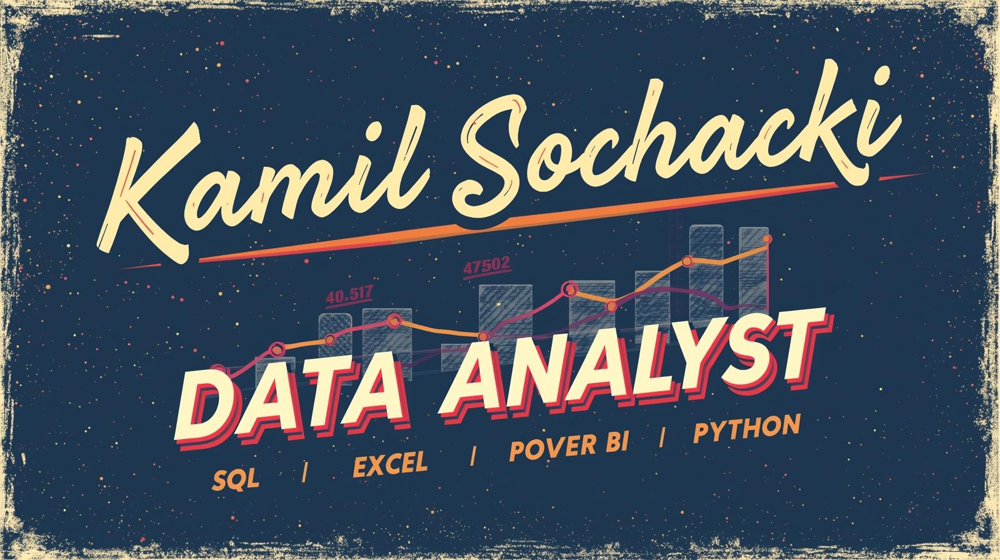

  

 

## About

I help businesses understand what their data is actually saying.  
My focus lies in structured SQL analysis, KPI framework design and building dashboards that support real decisions.

Currently preparing for the Microsoft PL-300 certification.  
Based in Vienna, working internationally.

---

## My Stack

SQL · Excel · Power BI · Python · Looker Studio  
BigQuery · dbt · Git · GitHub · Jupyter  

---

## Focus

- Business Intelligence & Reporting  
- KPI Design & Performance Analytics  
- Data Modeling & SQL Optimization  
- Dashboard Development  
- Reporting Automation  

---

## Connect

Vienna, Austria  
[LinkedIn](https://www.linkedin.com/in/yourprofile)
